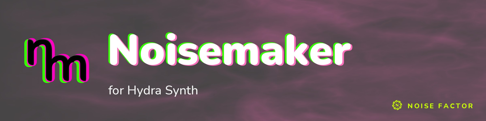

<!-- repo-hero -->
<a href="https://noisemaker.app/"></a>

<sub>Open source from <a href="https://noisefactor.io">Noise Factor</a> &middot; <a href="https://github.com/noisefactorllc">more projects</a></sub>

# Noisemaker for Hydra Synth

Noisemaker for Hydra Synth is an experimental demo port of Hydra's GLSL effects to the [Noisemaker](https://noisemaker.app/) rendering engine. These effects can be mixed with Noisemaker effects in the same program chains.

This is intended only as a tech demo that shows how to integrate the Noisemaker renderer into other projects.

## Use from a module

When this checkout is installed as a local package:

```js
import {
  DEFAULT_CDN,
  loadHydraEffects
} from 'noisemaker-for-hydra-synth'

const engine = await loadHydraEffects()
const renderer = new engine.CanvasRenderer({
  canvas: document.querySelector('canvas'),
  basePath: DEFAULT_CDN,
  bundlePath: `${DEFAULT_CDN}/effects`,
  useBundles: true
})

await renderer.loadManifest()
await renderer.compile(`search hydra
hydraOsc(frequency: 30, sync: 0.1, offset: 0.1).write(o0)`)
renderer.start()
```

`osc` is exposed as `hydraOsc` because Noisemaker reserves `osc` for animated parameters.

## Supported hosts and ownership

Supported hosts are browsers with a WebGL2 implementation and network access to the engine CDN (`https://shaders.noisedeck.app/1`); the engine loads at runtime, so offline use is not supported. Measured hosts: Chromium 154.0.8037.57 headless (SwiftShader WebGL2, Debian 12 Linux), Firefox 155.0 (Mesa llvmpipe software WebGL2 under Xvfb, Debian 12 Linux), Chromium 153.0.8010.12 headless with hardware-accelerated WebGL2 (ANGLE Metal on Apple M4, macOS), and Chrome 153.0.8010.53 (Apple M4, macOS 26.5). Windows, GPU-hardware Linux, and Safari remain unmeasured. WebGPU is not supported; do not set `preferWebGPU: true`.

Resource ownership:

- The caller owns the canvas element. The renderer never resizes the caller's canvas: set `canvas.width`/`canvas.height` yourself and call `renderer.resize(width, height)` so the pipeline matches.
- Textures uploaded through `renderer.updateTextureFromSource(textureId, source)` (for example the `synth/media` effect's `imageTex_step_<index>` binding) are managed by the renderer and released when `renderer.dispose()` is called.
- `renderer.stop()` cancels the render loop; `renderer.start()` resumes it. `renderer.dispose()` releases the pipeline's surfaces and GPU resources.

## Browser bundle

```html
<script src="./dist/hydra-synth.js"></script>
<script type="module">
  const engine = await window.HydraEffects.loadHydraEffects()
</script>
```

The historical `hydra-synth.js` artifact name is retained for the editor's internal bundle path. The project identity is `Noisemaker for Hydra Synth` and the repository/package name is `noisemaker-for-hydra-synth`.

## Requirements and dependency contract

- **Runtime dependency:** the package has no production npm dependencies. Its one runtime dependency is the Noisemaker engine bundle, which `loadHydraEffects()` loads from the engine CDN `https://shaders.noisedeck.app/1` at runtime. The `/1` base path is rolling: served engine bytes move with upstream releases, so offline use is not supported and a host that needs an immutable engine can pin a copy by passing `{ cdn: <basePath> }` (or a preloaded engine via `{ engine }`).
- **Browser runtime:** any browser with a WebGL2 implementation and network access to the engine CDN, per [Supported hosts](#supported-hosts-and-ownership). WebGPU is not supported.
- **Development tooling:** `npm run build` and `npm test` need Node 22 or newer, the Node.js lines supported today (22, 24 and 26); `esbuild` itself accepts Node 18 and later. CI runs on Node 24, and the suites pass on 22 and 26. The browser runtime has no Node requirement.
- **License:** AGPL-3.0-only, matching the verbatim AGPLv3 `LICENSE` text.

## Develop and verify

```sh
npm install
npm run build
npm test
```

The test command runs Node contract tests and exact browser pixel comparisons against upstream Hydra, including native-to-Hydra and Hydra-to-native surface transitions. The installed-package qualification (about ten minutes of installs and browser cycles) runs only with `HS_INSTALLED_WORKFLOW=1`. On every push CI runs the Node tests; the rendered gates and installed-package qualifications run weekly and on demand.

## Upstream

Hydra effect definitions originate from [hydra-synth](https://github.com/ojack/hydra-synth). This fork retains the upstream AGPL license and attribution history.
